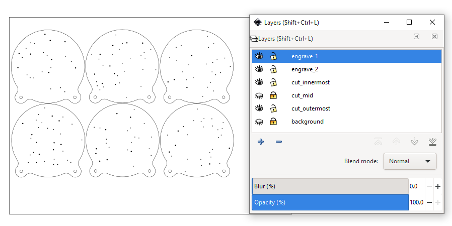
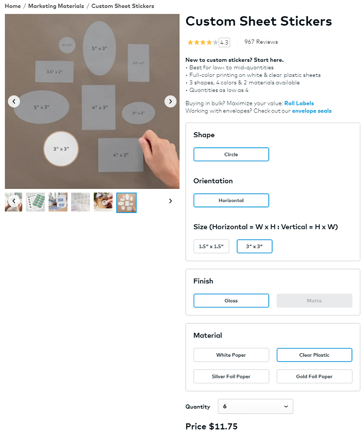
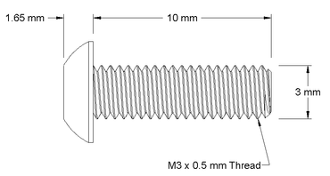
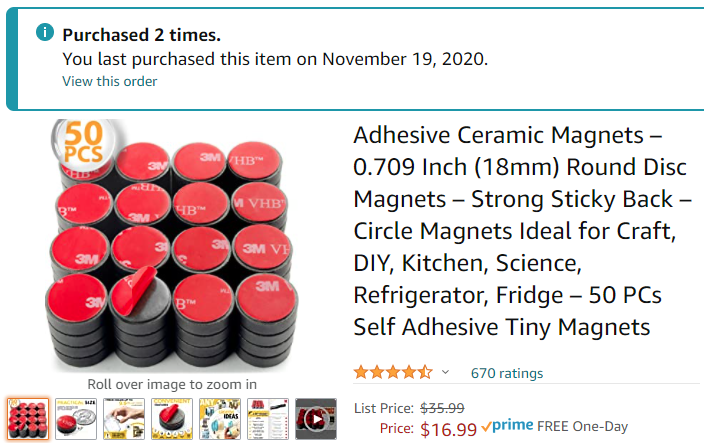
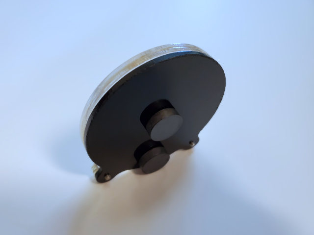

This is a small display for my astrophotographs. The photograph is printed on a sticker that's stuck to a black acrylic sheet at the back. Layers of clear acrylic sheets is stacked in front of the sticker, each layer has stars laser-etched on. This achieves a floating stars effect, inspired by snow-globes.

The SVG files used to laser-cut and laser-etch the acrylic sheets can be downloaded from this GitHub repo. The files are layered and optimized for making 6 pieces at a time on A4 sized acrylic sheets. The stars are randomly arranged, and two versions of arrangments are provided (12 different randomizations total).

One disk of black and two disks of the star-studded disks are used for each piece. More star-studded disk can be used but the reflections start to make the photograph appear too dark. Two is my recommendation.

The stickers are printed by Vistaprint.

The holes on the "back" piece requires a M3 threading tap, so no nuts are required. The holes on the "stars" sheet are sized to be through-holes. The screws are 10mm long M3 threaded screws, which is a good size for a stack of 3 acrylic sheets.

Sticky magnets are used on the back to turn these into fridge magnets. Place two magnets on each, make sure one magnet is at the bottom, which helps it stand up when placed on a desk. Make sure the magnets are thicker than how long the screws stick out.

During assembly, wear gloves, and keep some lens-wipes and air-duster around to remove smudges and dust.
