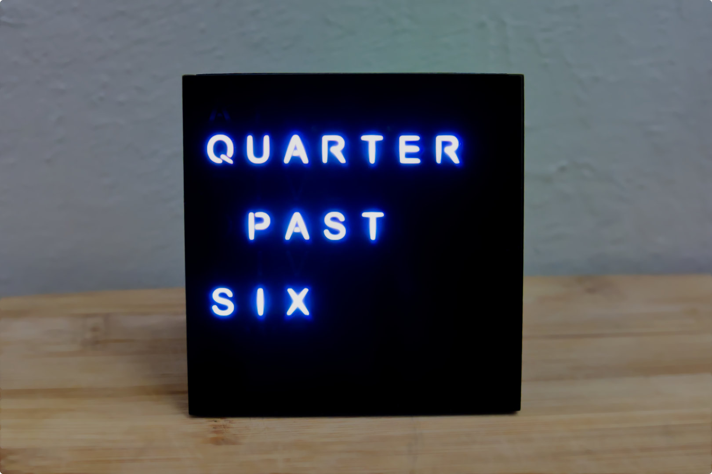
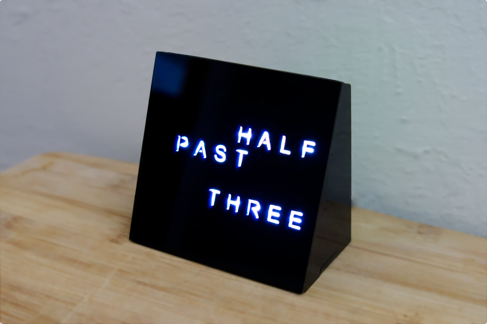
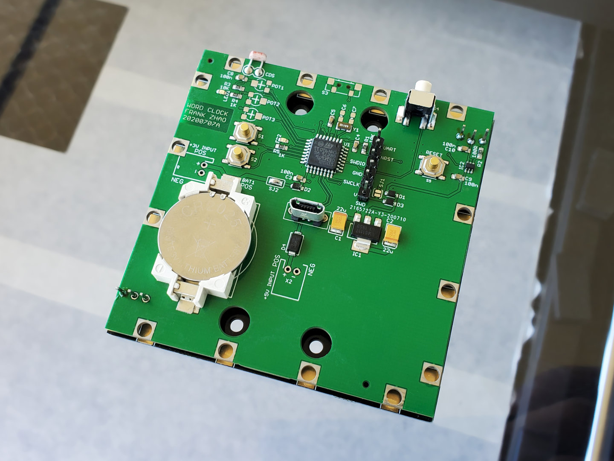
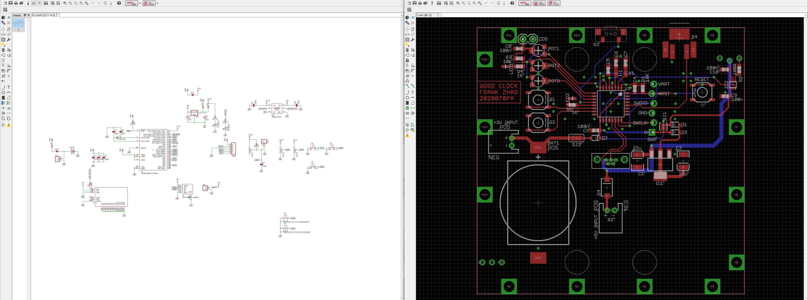
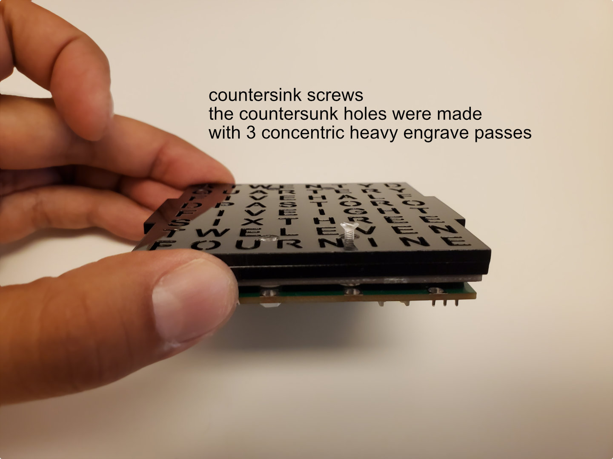
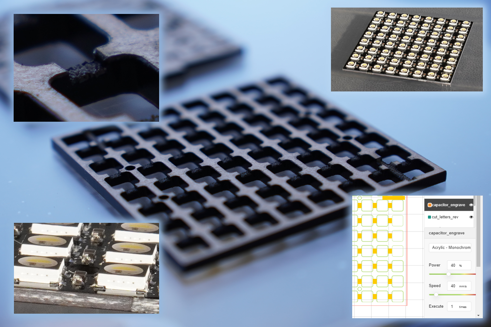
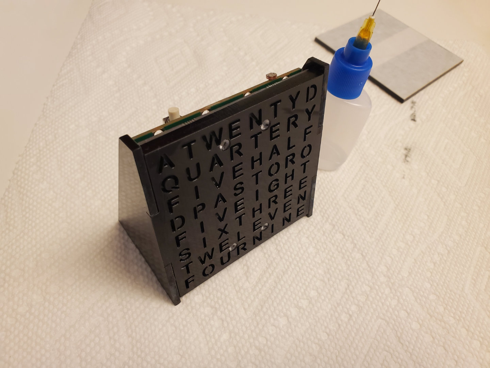

NeoPixel Word Clock
===================

A small word clock using a 8x8 NeoPixel matrix, controlled by a STM32L051K8

3D Model
========

Circuit
=======

The PCB and PCBA were made with JLCPCB. This is why some of the component choices are weird, I had to use what JLCPCB had in stock.

Features:
=========
 * stealthy clean look, you can't see the letters until they are lit
 * powered by USB
 * 2 buttons to set the time
 * a light sensor to dim the light while I sleep
 * 1 button to set a higher brightness during dark mode
 * RTC with back-up power
 * randomized animations

Firmware is written in C, using the Atollic TrueSTUDIO IDE for STM32.

All firmware and CAD files are open source and available for you to use freely.

More Pics
=========

grooves to clear the SMD capacitors are also cut out using heavy laser engraving.

Credits:
=======

I used https://github.com/hubmartin/WS2812B_STM32L083CZ/ to control the NeoPixels with the STM32L051K8. The modifications I made have been contributed back as pull requests against the original repo.

The lettering stencil is a copy of https://learn.adafruit.com/neomatrix-8x8-word-clock . I simply like my clean stealth look much better than the Adafruit version.