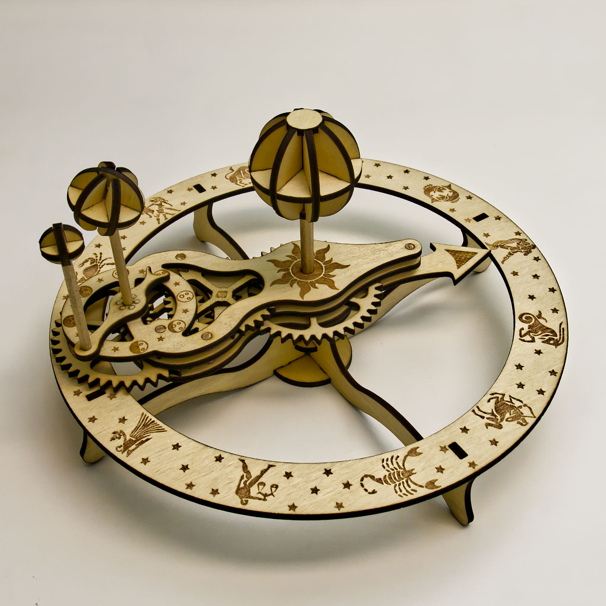

Orrery
======

This is a small mechanical model of the Sun, Earth, and Moon. There is artwork on it that depicts the corresponding Zodiac as the Earth moves around the Sun, and the Moon phases as the Moon orbits the Earth. The tilt of the Earth indicates the season of the year.

The pieces are to be cut on 3mm thick plywood. Two sheet files are provided, each sheet will fit into a 300x210mm lasering area. Also required are 3/16 inch round dowel rods, 1/8 inch round dowel rods, 1/8 inch square dowel rods, and some toothpicks.

The design was first made in 3D with SolidWorks. Artwork was edited in Affinity Designer first. The layout and DXF processing was done in Inkscape. All of these files are provided, optimized for the [FLUX Beamo](https://eleccelerator.com/beamo-laser-cutter-review/) but will work for all laser cutters.

Tolerances can be adjusted within the SVG file, as I have converted some path objects to circles and rectangles, so the diameters and widths can be manipulated easily. This is so it can accomodate varying laser beams, wood thicknesses, dowel diameters, etc.

Instructions are provided, see the "instructions" directory.

Pictures and design explanation: https://eleccelerator.com/orrery-laser-cut-wood-project/

Originally inspired by https://www.dreipunkt-verlag.de/shop/baus%C3%A4tze/bausatz-tellurium/ , my design is much smaller and require only a small laser cutter.
